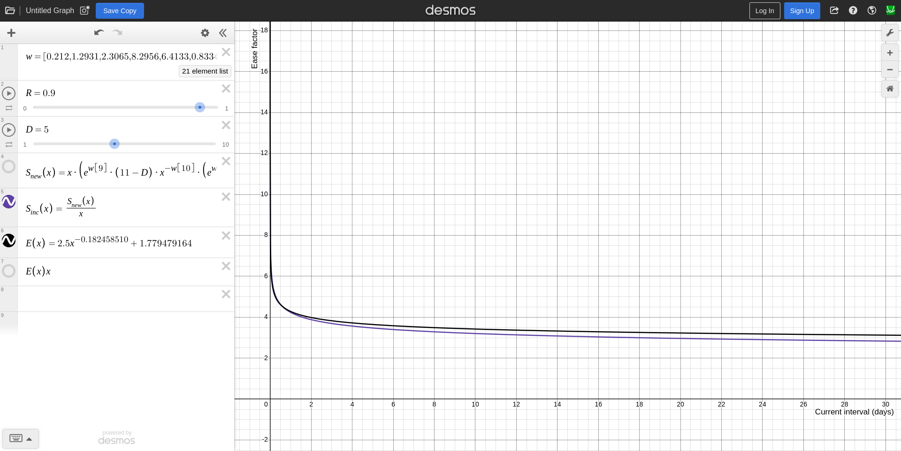

# Converting FSRS to SM-2 parameters

Enhancing the Anki SM-2 algorithm by converting the ease factor from a scalar
value to a mathematical function that takes two parameters, the current ease
factor and current interval of the card, allows us to approximate FSRS's
stability increase function with a simple power function.

According to the [FSRS
algorithm](https://github.com/open-spaced-repetition/fsrs4anki/wiki/The-Algorithm/e6ded59fa6d1d6bb2950a759d53b14575e9e586c), 
the new stability after successful review is calculated as
\\[
S^\prime_r(D,S,R,G) = S \cdot (e^{w_8} \cdot (11-D) \cdot S^{-w_9} \cdot (e^{w_{10}\cdot(1-R)}-1) \cdot w_{15}(\textrm{if G = 2}) \cdot w_{16}(\textrm{if G = 4}) + 1)
\\]

and since

> Let \\(SInc\\) (the increase in stability) denotes \\(\frac{S^{'}_{r}(D, S,
> R, G)}{S}\\) which is equivalent to Anki's ease factor.

we can approximate \\(SInc\\) with the function \\(k \cdot x^a + b\\) where
\\(k\\) is the current ease factor which has the initial value provided by
[Starting Ease](https://docs.ankiweb.net/deck-options.html#starting-ease),
\\(x\\) is the current interval, and \\(a\\) and \\(b\\) is some constant that
provides the curve of best fit to the \\(SInc\\) function.

That is, 

\\[
\text{EaseFactor} = k \cdot x^a + b
\\]

in the Anki SM-2 next interval function

\\[
\text{NewInterval} = \text{OldInterval} \times \text{EaseFactor} \times
\text{IntervalModifier}
\\]

## Retrieving optimized FSRS parameters

**IMPORTANT**: If you do not have many reviews for the optimizer to train on, or
you have previously used Anki incorrectly, such as pressing the Hard button
instead of the Again button to fail a card, it is recommended to use the default
FSRS-6 parameters until your review history is large enough for optimization.

First, retrieve your optimized FSRS parameters. This can be done either by

1. Directly in Anki
2. FSRS Optimizer Jupyter Notebook

### Anki

FSRS can safely be temporarily enabled in the deck options preset by

1. Click on the **Gear icon** next to your deck.
2. Click on the **Options** button.
3. Navigate down to the **FSRS** section and click on the **toggle button** to
   enable FSRS.
4. Leave **Desired retention** to the default value. Changing this has no effect on
   the final parameters.
5. Copy and save the **FSRS parameters** somewhere for later.
6. (Optional) Click on the **Compute minimum recommended retention** label and
   click the **Compute** button. Copy and save the **Minimum recommended
   retention** value somewhere for later.
7. Close the deck options preset window and click on **Discard** to discard
   changes.

### FSRS Optimizer Jupyter Notebook

Alternatively, if you don't want to temporarily enable FSRS, the FSRS Optimizer
Jupyter Notebook can be used instead which provides extra statistics and graphs
about your review history.

1. Go to the [FSRS4Anki
   Optimizer](https://github.com/open-spaced-repetition/fsrs4anki/blob/main/fsrs4anki_optimizer.ipynb).
2. Click on the **Open in Colab** button.
3. Follow the instructions provided in the notebook.
4. Scroll down to the **Result** section
5. Copy and save the **optimized FSRS parameters** somewhere for later.
6. (Optional) Scroll down to the **Optimize retention to minimize the time of
   reviwes** section, copy and save the **suggested retention** value somewhere
   for later.

## Convert FSRS to SM-2

To convert your optimized FSRS parameters to SM-2

1. Go to the [FSRS to SM-2
   notebook](https://github.com/kuroahna/anki_srs_kai/blob/main/fsrs_to_sm2.ipynb).
2. Click on the **Open in Colab** button.
3. Replace `parameters` with your optimized FSRS parameter values.
4. Replace `starting_ease` with the same [Starting
   Ease](https://docs.ankiweb.net/deck-options.html#starting-ease) value in your
   deck options preset.
5. Replace `desired_retention` with your desired retention. Optionally, you can
   use the **Minimum recommended retention** value from above.
6. Click on the **Runtime** button in the toolbar at the top.
7. Click on the **Run all** button.
8. Scroll down to for the suggested values.

For example, with the FSRS-5 default parameters and default Anki SM-2 settings,

```python
parameters = [0.212, 1.2931, 2.3065, 8.2956, 6.4133, 0.8334, 3.0194, 0.001,
              1.8722, 0.1666, 0.796, 1.4835, 0.0614, 0.2629, 1.6483, 0.6014,
              1.8729, 0.5425, 0.0912, 0.0658, 0.1542]
starting_ease = 2.5
desired_retention = 0.90
```

The output is
```
Replace your settings in the Deck Options for your deck with the values below.
Note:
1. Use `Graduating interval (good)` if you often press Good when first learning
   a new card
2. Otherwise, use `Graduating interval (hard)` if you often press Hard when
   first learning a new card
3. Otherwise, use `Graduating interval (again)` if you often press Again when
   first learning a new card
4. If you're not sure, use `Graduating interval (good)`
This is because FSRS considers the first rating for New cards when training its
parameters. Since Anki SM-2 does not consider the first rating for New cards, it
is best to set the Graduating interval to the one you most often use


Graduating interval (again): 0
Graduating interval (hard): 1
Graduating interval (good): 2
Easy interval: 8


Replace the scheduler settings for your deck in the Custom scheduling field in
the Deck Options with the following values:


scheduler: {
    // ... (other settings)
    intervalModifier: 1.0,
    calculateHardMultiplier: (currentEaseFactor, currentInterval) => {
        return currentEaseFactor * Math.pow(currentInterval, -0.077098162) + (0.144440985);
    },
    calculateGoodMultiplier: (currentEaseFactor, currentInterval) => {
        return currentEaseFactor * Math.pow(currentInterval, -0.182458510) + (1.779479164);
    },
    calculateEasyMultiplier: (currentEaseFactor, currentInterval) => {
        return currentEaseFactor * Math.pow(currentInterval, -0.183552566) + (3.407921198);
    },
},
```

Follow the instructions in the Jupyter notebook output as shown above.

1. Click on the **Gear icon** next to your deck.
2. Click on the **Options** button.
3. Set the [Graduating
   interval](https://docs.ankiweb.net/deck-options.html#graduating-interval) to
   one of the suggested values depending on your review habits. If you are not
   sure, use the **Graduating interval (good)** value.
4. (Optional) Set the [Minimum
   interval](https://docs.ankiweb.net/deck-options.html#minimum-interval) to one
   of the suggested graduating interval values depending on your review habits.
   If you are not sure, use the **Graduating interval (good)** value.
5. Set the [Easy
   interval](https://docs.ankiweb.net/deck-options.html#easy-interval) to the
   suggested value.
6. Scroll down to **Advanced** section, click on **Custom scheduling**, and
   replace the `scheduler` section in the associated deck in `deckOptions`
7. Click on **Save**.

## Fine tuning the parameters

Assuming the Good button is pressed for each review, we can
[graph](https://www.desmos.com/calculator/comgwaxi4y) the functions \\(SInc\\)
and `calculateGoodMultiplier` (similar graphs can be created for the Hard and
Easy buttons).



As shown in the graph above, as the interval of a card increases, the smaller
the ease factor (ie, the increase in interval) which solves the long intervals
for mature cards issue with SM-2. If the ease factor function grows too fast or
too slow, you can modify the parameters accordingly.

## Reschedule all cards immediately

FSRS has the option to [reschedule cards on
change](https://docs.ankiweb.net/deck-options.html#reschedule-cards-on-change)
which will reschedule **all** cards with new intervals immediately instead of
being rescheduled as it comes up during reviews. While this can be temporarily
used as part of the conversion from FSRS to SM-2, it is **not recommended**
since it often results in a large number of cards becoming due. Instead, it is
recommended to allow cards reschedule with the custom scheduler as it comes up
during reviews. This means that it will **take a few weeks or months before any
visible results can be observed with the new scheduler**.
