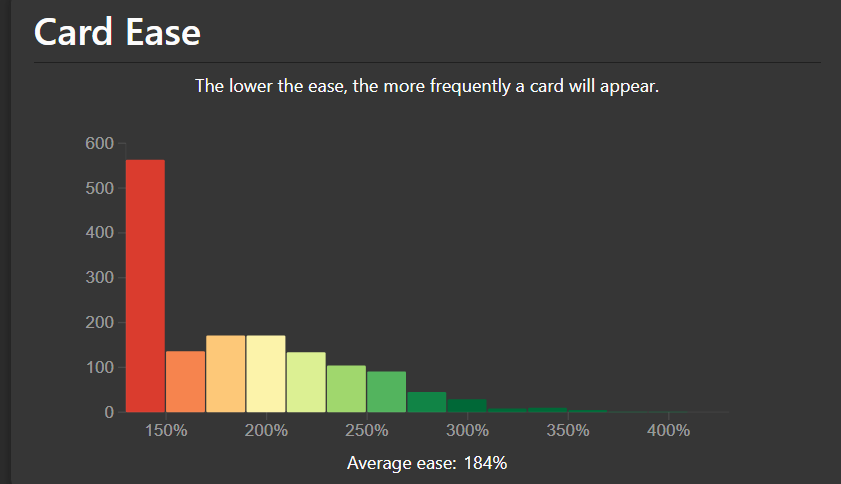

# Issues with Anki SM-2

The issues with the default Anki SuperMemo 2 (SM-2) algorithm are

1. Ease Hell
2. Short intervals for new cards
3. Long intervals for mature cards

## Ease Hell

At a high level, when calculating the next interval for a review card, Anki SM-2
performs the calculation:

\\[
\text{NewInterval} = \text{OldInterval} \times \text{EaseFactor} \times
\text{IntervalModifier}
\\]

And pressing the buttons
1. **Again:** decreases the ease factor by 20%.
2. **Hard:** decreases the ease factor by 15%.
3. **Good:** does not affect the ease factor.
4. **Easy:** increases the ease factor by 15%.

The only way to increase the ease factor for a card is to press the Easy button.

Ease Hell is when a card's ease factor keeps decreasing by pressing the Again or
Hard buttons, and inevitably gets capped at 130%. This means that the card will
be reviewed unnecessarily very often since the interval grows very slowly.

Using the Easy button more often can fix this issue, but deciding whether to
press the Easy button to increase the ease factor or not introduces extra mental
fatigue while reviewing. Additionally, the ease factor of a card is not shown
during reviews. Moreover, some users only use the Again and Good buttons (ie,
Pass/Fail) to reduce mental fatigue. In this case, the ease factor of a card
will never increase.

The Anki add-on [Straight Reward](https://ankiweb.net/shared/info/957961234)
addresses this issue by rewarding consecutive successful reviews with an ease
factor bonus.

Anki SRS Kai natively implements the Straight Reward algorithm to address this
issue and has been renamed to [Ease Reward](easeReward.md).

You can determine if your deck is stuck in Ease Hell by navigating to the
**Statistics** screen and navigating to the **Card Ease** graph. The image below
is an example of a deck stuck in Ease Hell where a large portion of the cards
are stuck at the minimum ease of 130%.

## Short intervals for new cards

The default [Graduating
Interval](https://docs.ankiweb.net/deck-options.html#graduating-interval) in
Anki is set to 1, which means a card will always be seen the next day after the
learning card becomes a review card.

According to [SuperMemo](https://supermemo.guru/wiki/Optimum_interval),
> The first optimum interval for review at retrievability of 90% is 3.96 days.

Additionally, FSRS [benchmarked](https://github.com/open-spaced-repetition/srs-benchmark/blob/45f61b2182c27da83839383ec3b044fa5ae27b47/README.md)
the accuracy of several SRS algorithms on a dataset of roughly 10,000 users.
FSRS-6 has a very high accuracy rate and was trained on a dataset of
approximately 10,000 Anki users, which resulted in the default parameters:

\\[
w = [0.212, 1.2931, 2.3065, 8.2956, \cdots]
\\]

The optimal first interval for review at retrievability of 90% when pressing
Good for a new card for the first rating is 2.3065 days. Visit the [FSRS
algorithm](https://github.com/open-spaced-repetition/fsrs4anki/wiki/The-Algorithm/e6ded59fa6d1d6bb2950a759d53b14575e9e586c)
for more details.

By setting the Graduating Interval to 1, the user is reviewing at a nonoptimal
time if the target retention is 90%

## Long intervals for mature cards

According to [SuperMemo](https://supermemo.guru/wiki/Stabilization),
> Memory stabilization (abbreviated \\(SInc\\) for _stability increase_) is the
> increase in memory stability as a result of the retrieval of a memory (e.g. in
> review). Stabilization may also be a result of memory optimization in sleep.
> 
> **The higher the stability, the lesser the stability increase at review.**

Additionally, according to
[FSRS](https://github.com/open-spaced-repetition/fsrs4anki/wiki/The-Algorithm/e6ded59fa6d1d6bb2950a759d53b14575e9e586c),
> **The larger the value of S, the smaller the SInc value.** This means that the
> higher the stability of the memory, the harder it becomes to make the memory
> even more stable.

Anki SM-2 does not make the increase in interval smaller as the current interval
gets larger. This means that the card is more likely to be forgotten by the time
it is reviewed.

For example, suppose a card has

\\[
\begin{align}
\text{OldInterval} &= 1000 \\\\
\text{EaseFactor} &= 2.5 \\\\
\text{IntervalModifier} &= 1.0 \\\\
\end{align}
\\]

then

\\[
\begin{align}
\text{NewInterval} &= \text{OldInterval} \times \text{EaseFactor} \times
\text{IntervalModifier} \\\\
&= 1000 \times 2.5 \times 1.0 \\\\
&= 2500
\end{align}
\\]

The interval for the card increased from 1000 days (or roughly 2.74 years) to
2500 days (or roughly 6.85 years). It is very likely that this increase in
interval is too large for most material and will be forgotten by the time it is
reviewed.
