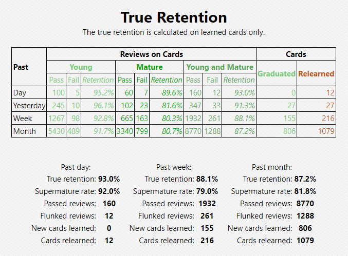
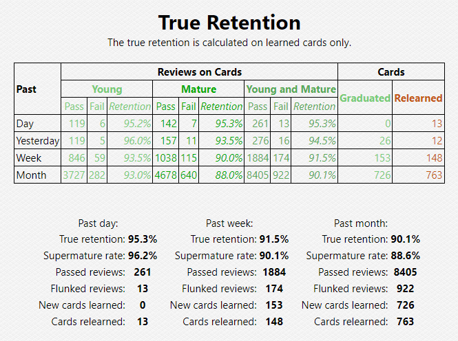
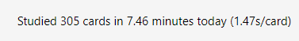
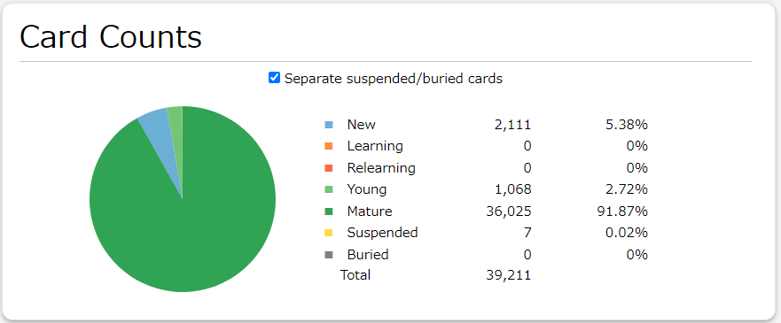
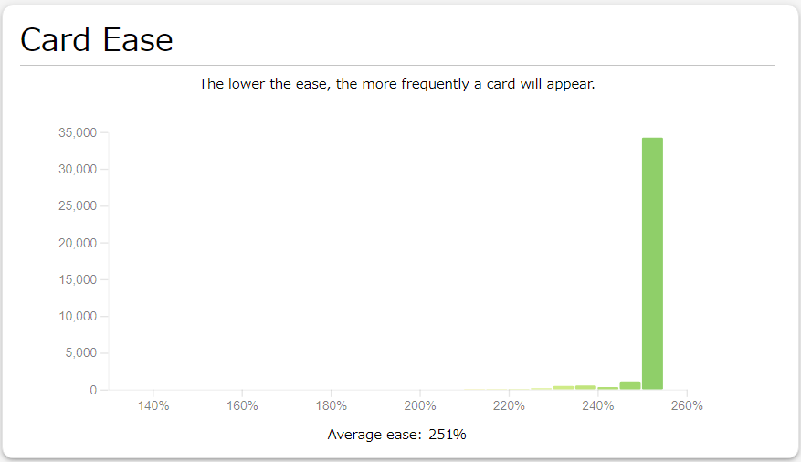

# Personal Results

After a year of testing on my Japanese deck from December 2023 with \~30,000 cards
learned to December 2024 with \~37,000 cards learned, using Anki SRS Kai over
Anki SM-2 has increased my monthly mature (cards with an interval greater than
or equal to 21) retention rate from 80.7% to 88%, monthly supermature (cards
with an interval greater than or equal to 100) retention from 81.8% to 88.6%,
and **reduced my daily workload by almost 17%**, from ~350 cards to review to
~300 cards to review each day.

Optimizing my deck with FSRS 4.5 produced the following parameters

```
w = [3.0764, 4.0925, 6.2791, 10.5132, 5.0603, 0.8525, 0.7931, 0.0993, 0.8338,
0.1, 0.9419, 2.0364, 0.1718, 0.4441, 1.3824, 0.0001, 3.9998]
```

which have later been converted to SM-2 parameters in the custom scheduler code
below.

## Previous Anki Settings

Daily Limits
* New cards/day: 20
* Maximum reviews/day: 9999
* New cards ignore review limit: off
* Limits start from top: off

New Cards
* Learning steps: 1m 10m 1h
* Graduating interval: 1
* Easy interval: 4
* Insertion order: Sequential (oldest cards first)

Lapses
* Relearning steps: 10m 1h
* Minimum interval: 1
* Leech threshold: 4
* Leech action: Suspend Card

Display Order
* New card gather order: Descending position
* New card sort order: Card type, then order gathered
* New/review order: Show before reviews
* Interday learning/review order: Mix with reviews
* Review sort order: Due date, then random

FSRS
* FSRS: off

Burying
* Bury new siblings: off
* Bury review siblings: off
* Bury interday learning siblings: off

Advanced
* Maximum interval: 1825
* Starting ease: 2.50
* Easy bonus: 1.30
* Interval modifier: 1.00
* Hard interval: 1.20
* New interval: 0.00
* Custom scheduling: empty

## New Anki Settings

Daily Limits
* New cards/day: 20
* Maximum reviews/day: 9999
* New cards ignore review limit: off
* Limits start from top: off

New Cards
* Learning steps: 1m 10m 1h
* **Graduating interval: 4**
* Easy interval: 4
* Insertion order: Sequential (oldest cards first)

Lapses
* Relearning steps: 10m 1h
* **Minimum interval: 3**
* Leech threshold: 4
* Leech action: Suspend Card

Display Order
* New card gather order: Descending position
* New card sort order: Card type, then order gathered
* New/review order: Show before reviews
* Interday learning/review order: Mix with reviews
* Review sort order: Due date, then random

FSRS
* FSRS: off

Burying
* Bury new siblings: off
* Bury review siblings: off
* Bury interday learning siblings: off

Advanced
* Maximum interval: 1825
* Starting ease: 2.50
* Easy bonus: 1.30
* Interval modifier: 1.00
* Hard interval: 1.20
* New interval: 0.00
* **Custom scheduling**:
```javascript
const deckOptions = {
    "日本語": {
        easeReward: {
            minimumConsecutiveSuccessfulReviewsRequiredForReward: 3,
            baseEaseReward: 0.05,
            stepEaseReward: 0.05,
            minimumEase: 1.30,
            maximumEase: 2.50,
        },
        scheduler: {
            enableFuzz: true,
            maximumInterval: 1825,
            intervalModifier: 1.00,
            calculateHardMultiplier: (currentEaseFactor, currentInterval) => {
                return 0.0;
            },
            calculateGoodMultiplier: (currentEaseFactor, currentInterval) => {
                return currentEaseFactor / Math.pow(currentInterval,
0.059729712);
            },
            calculateEasyMultiplier: (currentEaseFactor, currentInterval) => {
                return 0.0;
            },
        },
    },
    "Global Settings": {
        easeReward: {
            minimumConsecutiveSuccessfulReviewsRequiredForReward: 3,
            baseEaseReward: 0.05,
            stepEaseReward: 0.05,
            minimumEase: 1.30,
            maximumEase: 2.50,
        },
        scheduler: {
            enableFuzz: true,
            maximumInterval: 1825,
            intervalModifier: 1.00,
            // Approximation of the default FSRS v4 parameters
            // [0.27, 0.74, 1.3, 5.52, 5.1, 1.02, 0.78, 0.06, 1.57, 0.14, 0.94, 2.16, 0.06, 0.31, 1.34, 0.21, 2.69]
            calculateHardMultiplier: (currentEaseFactor, currentInterval) => {
                return 0.0;
            },
            calculateGoodMultiplier: (currentEaseFactor, currentInterval) => {
                return (currentEaseFactor / Math.pow(currentInterval,
0.024210328));
            },
            calculateEasyMultiplier: (currentEaseFactor, currentInterval) => {
                return 0.0;
            },
        },
    },
};

// Anki SRS Kai code below
// ...
```

## Statistics

The image below is my retention rate using Anki SM-2.



The image below is my retention rate using Anki SRS Kai.








